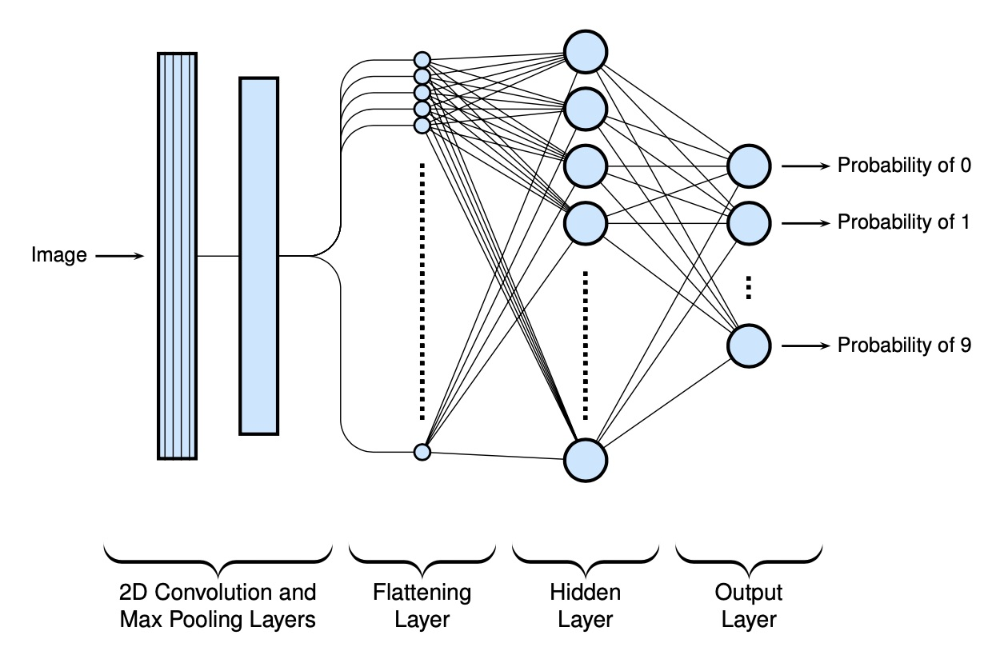
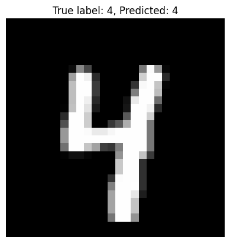

# Handwritten-Digit-Classification-Using-ANN

A neural network built from scratch to classify handwritten digits from the MNIST dataset.

- **Technologies Used**: numpy
- **Highlights**:
  - Custom architecture with 3 dense layers
  - Achieved 97% accuracy
  - Confusion matrix and prediction examples

## 1. Model Architecture

## 2. Output 

We assume the image data of 28x28 is flatern into 784x1 dimension:

